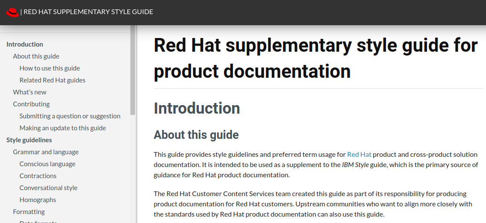

== About

A simple containerized Asciidoctor build that you can use build a clean and responsive single-page website.

.Example output

CSS based on https://github.com/uroesch/asciidoctor-readthedocs-theme

== Prerequisites

* Install Podman

* Add the following line to your source repo `.gitignore` and commit the change:
+
[source,text]
----
assets
----

== Running the build locally

. Set the `toc-title` document attribute in your AsciiDoc assembly file:
+
[source,asciidoc]
----
:toc-title: <document_title>
----

. Open a shell prompt at the folder containing your assembly.

. Pull the container image with Podman:
+
[source,terminal]
----
$ podman pull quay.io/redhat-docs/redhat-docs-template
----

. Load the build assets to the local context:
+
[source,terminal]
----
$ podman cp $(podman run --detach quay.io/redhat-docs/redhat-docs-template):/assets ./assets
----

. Optional. Add a custom SVG format logo:
+
[source,terminal]
----
$ cp <path_to_logo> assets/img/logo.svg
----

. Run the build:
+
[source,terminal]
----
$ podman run --rm -it -v "$(pwd)":/docs:Z quay.io/redhat-docs/redhat-docs-template <asciidoc_assembly_file>
----

== Using the container build in a GitHub action

Copy the following YAML to the `.github/workflows/deploy-site.yml` file in your repository. Commit and push the changes to deploy the site using GitHib pages.

.Example deploy-site.yml
[source,yaml]
----
name: Build and deploy website

on:
  push:
    branches:
      - main

jobs:
  build:
    runs-on: ubuntu-latest

    steps:
      - name: Checkout Repository
        uses: actions/checkout@v3

      - name: Extract assets
        run: docker cp $(docker run --detach quay.io/redhat-docs/redhat-docs-template):/assets ./assets

      - name: Build AsciiDoc
        uses: docker://quay.io/redhat-docs/redhat-docs-template
        with:
          args: main.adoc

      - name: Copy output to docs/
        run: |
          mkdir docs
          cp -r assets/ docs/assets
          cp -r images/ docs/images
          mv index.html docs/

      - name: Publish to GitHub Pages
        uses: peaceiris/actions-gh-pages@v3
        with:
          github_token: ${{ secrets.GITHUB_TOKEN }}
          publish_dir: ./docs
----

=== Adding a custom navbar logo to the GitHub action build

. Add the custom SVG format logo file to your repo.

. Add the following line to the `Copy output to docs/` stage in `.github/workflows/deploy-site.yml`:
+
[source,terminal]
----
cp <relative_path_to_logo> docs/assets/img/logo.svg
----

. Commit the changes to redeploy the site with the new logo.
